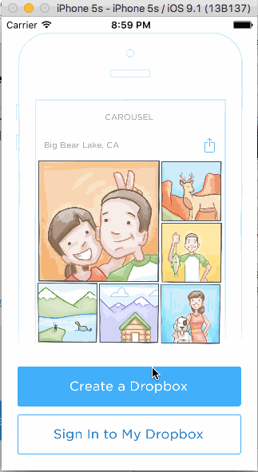

# Week 2 Project: Carousel

This Carousel app's purpose is to leverage views, view properties, and events to create a high fidelity prototype that is difficult to distinguish from a production app. This Carousel app goes from the signed out state to the basic signed in state.

Time spent: 14 hours spent in total

Completed user stories:

Static photo tiles on the initial screen
-Optional: Photo tiles move with scrolling

Sign In
-Tapping on email/password reveals the keyboard and shifts the scrollview and Sign In button up.
-Upon tapping the Sign In button.
--If the username or password fields are empty, user sees an error alert.
--If credentials are incorrect, user sees a loading indicator for 2 seconds followed by an error alert.
--If the credentials are correct, user sees a loading indicator for 2 seconds followed by a transition to the Sign In screens.
-Optional: When the keyboard is visible, if the user pulls down on the scrollview, it will dismiss the keyboard.
-Optional: On appear, scale the form up and fade it in.

Optional: Create a Dropbox
-Optional: Tapping in the form reveals the keyboard and shifts the scrollview and "Create a Dropbox" button up.
-Optional: Tapping the Agree to Terms checkbox selects the checkbox.
-Optional: Tapping on Terms shows a webview with the terms.
-Optional: User is taken to the tutorial screens upon tapping the "Create a Dropbox" button.

Tutorial Screens
-User can page between the screens
-Optional: User can page between the screens with updated dots
-Optional: Upon reaching the 4th page, hide the dots and show the "Take Carousel for a Spin" button.

Image Timeline
-Display a scrollable view of images.
-User can tap on the conversations button to see the conversations screen (push).
-User can tap on the profile image to see the settings view (modal from below).

Conversations
-User can dismiss the conversations screen

Settings
-User can dismiss the settings screen.
-User can log out

Optional: Learn more about Carousel
-Optional: Show the "Learn more about Carousel" button in the photo timeline.
-Optional: Tap the X to dismiss the banner

Walkthrough of Dropbox app:

GIF created with [LiceCap](http://www.cockos.com/licecap/).

# Carousel
